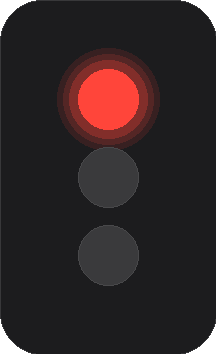

<p align="center">
  
</p>

<h1 align="center">Traffic Light Widget</h1>

A tiny floating **Windows 11** desktop widget that shows your **AI coding
agent's activity** as a traffic light. Dark, minimal, no text — just the
light. Supports **opencode** and **Copilot Chat**.

- **Red**:    actively coding — LLM generating, tools running, files edited
- **Orange**: asking for permission or a question pending your input
- **Green**:  finished — turn ended, session idle
- **Dim green**: parked — no active backend, auto-hides after 60s



## Requirements

- **Windows 11** (10 also works)
- **Python 3.10+** with Tkinter (`python.org` installer includes it)
- Either **opencode** or **GitHub Copilot Chat** in VS Code

## Install

```powershell
cd traffic-light-widget
powershell -NoProfile -ExecutionPolicy Bypass -File .\install.ps1
```

Copies to `%LOCALAPPDATA%\TrafficLightWidget` and creates a Startup shortcut.
**No admin.**

Uninstall:

```powershell
powershell -NoProfile -ExecutionPolicy Bypass -File .\uninstall.ps1
```

Run once without installing:

```powershell
pythonw TrafficLightWidget.py
```

## How it works

The widget reads **local log files** — no network, no credentials, no telemetry.

### Backends

| Backend | Data source | State signals |
|---|---|---|
| **opencode** | `~/.local/share/opencode/log/opencode.log` | `message=stream`/`loop`/`process` (Red), `action=ask`/`message=asking` (Orange), idle (Green) |
| **Copilot Chat** | `~/.copilot/session-state/<session>/events.jsonl` | `turn_start`/`tool.execution_start` (Red), tool awaiting confirmation / `?` (Orange), `turn_end`/`shutdown` (Green) |

Switch backends via **right-click → Backend → opencode / copilot / auto**.
Auto picks whichever was most recently active.

### Auto-hide

When neither backend has been active for 60 seconds, the widget auto-hides to
the system tray. It pops back up automatically when you start coding again.
Manual "Hide to tray" is respected — auto-show won't override it.

### System tray

Close the widget (right-click or window close) to minimize to the notification
area as a colored circle. Left-click to restore. The tray uses raw Win32
`Shell_NotifyIconW` via `ctypes` — stdlib only, no dependencies.

## Files

| file | role |
|---|---|
| `TrafficLightWidget.py` | the widget (stdlib + Tkinter + ctypes) |
| `install.ps1` / `uninstall.ps1` | per-user startup / teardown |
| `build.ps1` | renders snapshot + icon (Pillow) |
| `traffic-light-icon.ico` | multi-size tray icon |
| `traffic-light-widget.png` | README snapshot |

State: `~/.config/traffic-light-widget/state.json`.
Data: `~/.local/share/opencode/log/opencode.log` / `~/.copilot/session-state/<session>/events.jsonl`.

## Notes

- **Orange for Copilot is best-effort.** Copilot Chat has no explicit
  "permission pending" signal; the widget infers it from tool timing and
  question marks. Falls back gracefully.
- **DPI aware** — per-monitor v2 on Windows 11.
- **No dependencies** — Python stdlib only. Pillow optional (build only).

## Origin

Adapted from the [Codex Session Widget](https://github.com/...) for AI agent
activity monitoring.

Free to use under [PolyForm NonCommercial 1.0.0](LICENSE).
